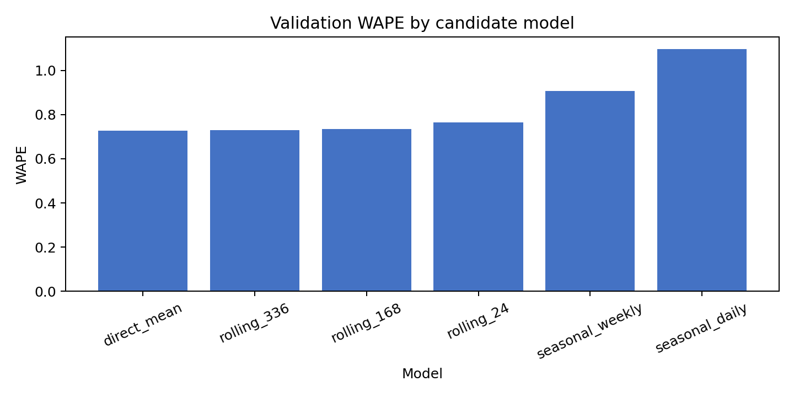
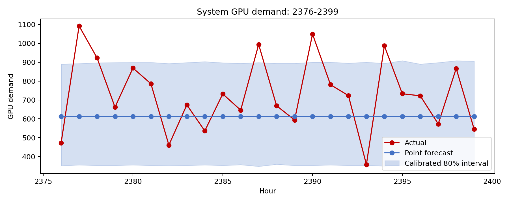

# 问题一：短期 GPU 需求预测模型完整报告

> 本报告对应 2026 年“华数杯”C 题问题一的**短期预测部分**。调度甘特图、任务迁移和 GPU 利用率属于问题一的基础调度部分，不在本报告中求解。预测模型的作用是刻画调度前能够获得的短时算力需求信息及其不确定性。
>
> 代码：`run_forecast.py`；配置：`forecast_config.json`；原始处理数据：`../步骤0_数据预处理与分析/processed/fact_tasks.csv`；全部可复现结果：`预测结果/`。

## 1. 问题理解与预测任务定义

题目要求基于 AI 工作负载数据，对不同区域、不同类型任务的 GPU 需求进行统计分析并建立短期预测模型。题目建议的时间划分为：

| 阶段 | 小时范围 | 用途 |
|---|---|---|
| 训练 | 0–2351 | 拟合候选模型和估计参数 |
| 验证 | 2352–2375 | 选择模型与参数 |
| 最终训练 | 0–2375 | 固定模型后重估参数 |
| 测试 | 2376–2399 | 只用于最终预测评价 |

原始任务数据提供到达小时 `ArrivalHour`、来源区域 `SourceRegion`、任务类型 `TaskType` 和单任务 GPU 需求 `GPU_Demand`。因此定义来源区域 r、任务类型 k、小时 t 的预测目标为：

```text
D(r,k,t) = Σ GPU_Demand(i)
```

其中求和范围为所有满足 `SourceRegion_i=r`、`TaskType_i=k`、`ArrivalHour_i=t` 的任务 i。该目标是该小时真实到达任务的**总 GPU 需求**，不是任务数，也不是调度后某执行区域的 GPU 占用。

本题共有 6 个来源区域和 3 类任务，故建立 18 条细粒度小时序列：

```text
RegionA…RegionF × AITraining / BatchInference / RealTimeInference
```

区域需求由同一区域三类任务相加，系统需求由全部 18 条序列相加。

### 1.1 预测与调度的关系

预测模型和基础调度模型是两个模块：

```text
历史任务数据
 ├─ 短期预测模型 → 预测 2376–2399 GPU 需求 → 与真实值比较
 └─ 基础调度模型 ← 2376–2399 实际到达任务 → 甘特图、GPU 利用率
```

题目明确：2376–2399 小时的预测精度仅用于预测评价；最后 24 小时调度必须使用实际到达任务。故预测结果不替代后续正式调度输入，也不传递给问题二至问题四。

## 2. 数据构造与探索性诊断

### 2.1 预测面板

处理后面板以 `Hour × SourceRegion × TaskType` 为索引，共：

```text
2400 小时 × 6 区域 × 3 类型 = 43,200 行
```

每行主要包含：

- `task_count`：到达任务数；
- `gpu_demand_sum`：预测目标 D(r,k,t)；
- `gpu_hours_sum`：任务 GPU 需求与时长折算后的 GPUh；
- 小时、日序号、周内位置等时间字段。

预测模型只把 `gpu_demand_sum` 作为主目标。任务数和单任务属性用于需求结构解释与不确定性模拟，不将两者强行作为互相独立的点预测对象。

### 2.2 序列规律检验

对 18 条 GPU 需求序列计算自相关和日历效应，结果如下。

| 任务类型 | 平均一阶自相关 | 平均 24 小时自相关 | 平均 168 小时自相关 | 小时效应解释率 | 周内效应解释率 |
|---|---:|---:|---:|---:|---:|
| AITraining | 0.004 | -0.010 | 0.011 | 1.00% | 0.34% |
| BatchInference | 0.003 | -0.006 | 0.005 | 1.09% | 0.21% |
| RealTimeInference | 0.018 | -0.002 | -0.002 | 0.90% | 0.21% |

可见，上一小时、上一日同小时、上一周同小时对当前 GPU 需求几乎没有稳定解释力；日内与周内规律也很弱。这意味着复杂时序模型难以获得可靠增益，反而容易拟合随机波动。

### 2.3 任务数与单任务 GPU 属性的关系

为避免把任务属性错误割裂，进一步在固定“来源区域 × 任务类型”后，检验每小时任务数与该小时单任务平均 GPU 需求的相关性：

| 类型 | 任务数与单任务平均 GPU 相关系数均值 |
|---|---:|
| AITraining | 0.002 |
| BatchInference | 0.004 |
| RealTimeInference | -0.011 |

这些相关系数接近 0；同时，单任务平均 GPU 需求跨四个训练分块的平均变异系数约为 2.15%。说明在给定来源区域和任务类型后，任务规模较稳定，而需求主要波动来自任务到达的随机性。

任务数的方差/均值在 18 条序列上的均值约为 0.992，接近 Poisson 离散程度；但不同区域和类型存在较多零需求小时。因此，预测报告同时给出点预测和区间，而不把单点结果解释为确定到达量。

## 3. 模型建立

### 3.1 主点预测模型：分层平稳直接需求模型

对每个来源区域 r 和任务类型 k，设预测原点为 T，则主模型为：

```text
D_hat(r,k,t) = (1 / (T+1)) × Σ_{τ=0}^{T} D(r,k,τ)
```

其中 t 为未来 24 小时中的任一时点。该模型对同一 r、k 在预测窗口内给出相同的条件期望值，原因不是假设未来任务完全相同，而是数据诊断未发现可验证的小时级时间依赖或季节规律。

模型具有三个优点：

1. 直接预测题目要求的总 GPU 需求，避免将任务数与 GPU 属性作为独立主目标；
2. 每个细粒度单元拥有最多 2352 个历史小时，均值估计稳定；
3. 参数极少、结果透明，能避免复杂模型在 24 小时测试窗上过拟合。

该模型在程序中命名为 `direct_mean`。

### 3.2 候选对照模型

为证明主模型的选择并非主观设定，建立以下对照：

| 模型 | 公式/规则 | 可调参数 |
|---|---|---|
| `direct_mean` | 使用预测原点前全历史分组均值 | 无 |
| `rolling_24` | 使用原点前 24 小时分组均值 | 窗口 24 |
| `rolling_168` | 使用原点前 168 小时分组均值 | 窗口 168 |
| `rolling_336` | 使用原点前 336 小时分组均值 | 窗口 336 |
| `seasonal_daily` | 取上一日相同小时值 | 季节周期 24 |
| `seasonal_weekly` | 取上一周相同小时值 | 季节周期 168 |

未把 LSTM、Transformer、复杂树模型作为主候选，理由是：训练序列长度有限、时间相关性和日历效应极弱、预测窗口仅 24 小时，复杂模型的自由度远高于可验证信号。

### 3.3 严格防止信息泄漏

每次预测均从单一预测原点一次性预测未来 24 小时：

```text
验证：用 Hour ≤ 2351，预测 2352–2375
测试：用 Hour ≤ 2375，预测 2376–2399
```

预测窗口内真实任务不能用于滞后变量、滚动均值、模型更新或参数选择。特别地，不能在预测第 2378 小时时使用第 2376、2377 小时的真实到达任务；那是在线滚动预测，不是题目规定的 24 小时离线测试。

## 4. 参数选择与模型调优

### 4.1 正式验证集比较

以 0–2351 小时为训练数据、2352–2375 小时为验证数据，比较候选模型：

| 模型 | MAE | RMSE | WAPE | Bias |
|---|---:|---:|---:|---:|
| direct_mean | **23.81** | 45.85 | **72.78%** | 1.34 |
| rolling_336 | 23.87 | 45.95 | 72.96% | 1.51 |
| rolling_168 | 24.02 | **45.84** | 73.41% | 2.01 |
| rolling_24 | 25.01 | 46.21 | 76.45% | 2.41 |
| seasonal_weekly | 29.64 | 60.58 | 90.58% | 5.93 |
| seasonal_daily | 35.85 | 69.92 | 109.57% | 2.41 |

模型选择以 WAPE 为主、MAE 为辅。`direct_mean` 同时取得最低 WAPE 和最低 MAE，故被选为最终点预测模型。虽然 `rolling_168` 的 RMSE 略低，但其 WAPE 和 MAE 均较差，且并未在滚动回测中表现更稳定。

### 4.2 训练期滚动回测

为避免只依赖一个 24 小时验证窗，从 Hour=1199 开始，每隔 24 小时取一个预测原点，共进行 48 个“训练历史 → 后续 24 小时”的滚动回测。结果为：

| 模型 | 平均 MAE | 平均 RMSE | 平均 WAPE | WAPE 标准差 |
|---|---:|---:|---:|---:|
| direct_mean | **26.21** | **50.57** | **76.34%** | **4.35%** |
| rolling_336 | 26.32 | 50.65 | 76.68% | 4.47% |
| rolling_168 | 26.38 | 50.78 | 76.85% | 4.51% |
| rolling_24 | 26.73 | 51.55 | 77.85% | 4.84% |
| seasonal_weekly | 33.81 | 70.07 | 98.55% | 7.08% |
| seasonal_daily | 34.55 | 71.50 | 100.71% | 7.03% |

进一步将 `direct_mean` 与 `rolling_336` 进行加权融合，令长期均值权重从 0 递增到 1。48 次回测中，权重越接近 1，平均 WAPE 越低；纯 `direct_mean` 仍最优。因此不引入额外融合权重。

### 4.3 Bootstrap 参数与区间校准

点预测描述条件期望，不能反映短时任务到达的随机性。为此采用完整小时任务包 Bootstrap：

1. 对预测原点 T 前的每个历史小时，保留该小时全部任务组成的完整任务包；
2. 每个任务包保留任务数、GPU 需求、任务时长、时延阈值、完成时限等原始联合属性；
3. 对每个未来小时，有放回地抽取一个完整历史小时任务包；
4. 重复 10,000 次，得到细粒度、区域和系统总 GPU 需求的经验分布；
5. 从经验分布计算区间上下界。

这避免了“独立抽任务数，再独立抽 GPU 需求”导致的任务属性割裂问题。

10,000 次模拟在相邻随机种子下的区间平均宽度几乎不变，故不需要增加模拟次数。由于任务需求是离散分布且零需求小时较多，传统 P10–P90 区间在滚动回测中实际覆盖约 89.46%，明显偏保守；P2.5–P97.5 的覆盖约为 97.56%。因此以 48 个滚动回测原点进行经验覆盖率校准：

| 输出层级 | 80% 经验区间 | 95% 经验区间 | 校准依据 |
|---|---|---|---|
| 区域×类型细粒度单元 | P17–P83 | P5–P95 | 滚动覆盖率接近 80% / 95% |
| 区域总量、系统总量 | P9.5–P90.5 | P3–P97 | 汇总后分布更平滑，单独校准 |

这些区间应在论文中称为“基于滚动回测覆盖率校准的经验预测区间”，而不是理论上的中心分位区间。

## 5. 最终测试结果

固定模型后，用 0–2375 小时数据重新估计分组均值，预测 2376–2399 小时。测试数据不参与任何模型选择或参数调节。

### 5.1 细粒度预测表现

在 18 条细粒度序列、24 个小时共 432 个预测单元上：

| 指标 | 测试结果 |
|---|---:|
| 实际 GPU 需求总和 | 17,449 |
| 点预测 GPU 需求总和 | 14,708.74 |
| MAE | 26.52 |
| RMSE | 53.79 |
| WAPE | 65.65% |
| Bias | -6.34 |
| 80% 区间覆盖率 | 78.94% |
| 95% 区间覆盖率 | 93.98% |

按类型汇总：

| 任务类型 | 实际 GPU 总量 | 预测 GPU 总量 | WAPE | 平均 Bias |
|---|---:|---:|---:|---:|
| AITraining | 14,236 | 11,778.89 | 64.52% | -17.06 |
| BatchInference | 2,583 | 2,257.36 | 70.82% | -2.26 |
| RealTimeInference | 630 | 672.48 | 70.02% | 0.30 |

测试窗的 AITraining 实际到达量高于长期均值，尤其集中在 RegionE、RegionF，因此系统点预测整体偏低。由于这一偏差没有在正式验证和滚动回测中稳定重复，不能据测试集结果事后提高训练任务预测值。

### 5.2 区域与系统汇总表现

将同一区域三类任务相加，并进一步汇总至系统层：

| 层级 | 测试 WAPE | 80% 区间覆盖率 | 95% 区间覆盖率 |
|---|---:|---:|---:|
| 区域与系统汇总单元合并 | 39.23% | 80.36% | 93.45% |
| 系统总 GPU 需求 | **24.30%** | 79.17% | 91.67% |

细粒度预测误差高于系统汇总误差，表明不同区域、类型的正负偏差在聚合后部分抵消。这也说明：若目标是系统级容量预留，应同时参考系统预测区间；若目标是区域级资源预留，则应使用区域层区间而不是只使用系统点预测。

## 6. 结果解释、边界与后续衔接

### 6.1 为什么简单模型优于复杂模型

当前任务到达数据的主要特征是高随机性而非强可预测周期：

- 时序自相关近似为 0；
- 小时/周内规律弱；
- 近期窗口、日周期、周周期模型均在验证和滚动回测中劣于长期均值；
- 单任务规模稳定，真正不稳定的是到达时刻和到达数量。

在这种情况下，复杂深度模型会把随机噪声当成可学习规律，较难在未见的 24 小时窗口中获得稳定提升。采用分层平稳直接需求模型并报告经验区间，是更可解释、可验证的选择。

### 6.2 模型局限

1. 点预测在每个“区域×类型”组内为平稳期望，不能准确预报某一小时是否出现大规模训练任务；
2. 测试集仅 24 小时，单个区域的覆盖率存在抽样波动，不能以某一个区域的测试偏差重新调参；
3. Bootstrap 描述历史任务包分布，假定未来任务包与历史任务包具有相同分布；
4. 预测模型不包含未来外生业务指标，因为附件未提供可在预测时点获得的可靠业务先验。

### 6.3 与基础调度模型的衔接

预测模型可用于说明预调度阶段的容量风险：例如使用区域/系统 80% 或 95% 区间上界评估需要预留的算力范围。但题目规定的正式基础调度必须以 2376–2399 小时真实任务为输入，故应按以下方式衔接：

```text
预测模型：预测评价 + 容量风险分析
基础调度：真实任务 + GPU/IT/设施功率/时延/完成时限约束
```

## 7. 可复现产物

| 文件 | 内容 |
|---|---|
| `forecast_config.json` | 训练窗口、预测窗口、随机种子、10,000 次模拟和分层区间分位点。 |
| `run_forecast.py` | 候选模型比较、滚动回测、最终预测、任务包 Bootstrap、图表生成。 |
| `预测结果/forecast_model_comparison.csv` | 正式验证集候选模型指标。 |
| `预测结果/forecast_rolling_backtest.csv` | 48 个滚动预测原点的汇总指标。 |
| `预测结果/forecast_point_results.csv` | 18 条细粒度预测、真实值与区间。 |
| `预测结果/forecast_aggregate_results.csv` | 区域和系统汇总结果。 |
| `预测结果/forecast_metrics.csv` | 区域×类型、区域、系统三层误差。 |
| `预测结果/forecast_interval_summary.csv` | 分层区间的覆盖率与宽度。 |
| `预测结果/forecast_diagnostics.md` | 自动生成的简明诊断。 |

图表：




